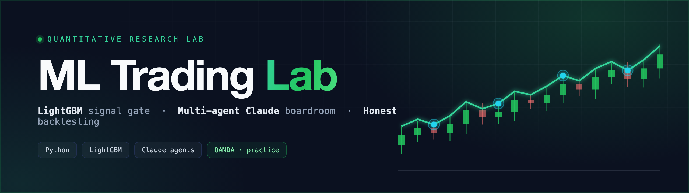
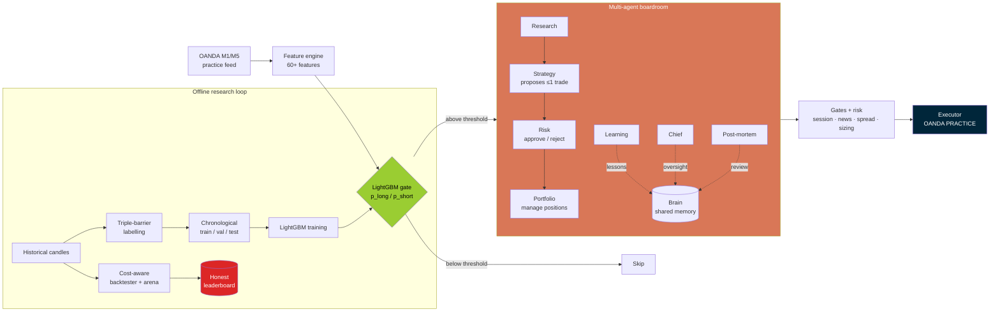

<div align="center">



<br/>

### A research framework that pairs a **leak-aware ML signal gate** with a **multi-agent Claude “boardroom” — and is radically honest that the strategies have no proven edge.**

Most “trading bot” repos sell you a magic edge. This one does the opposite: world-class engineering discipline, an LLM decision layer kept on a *tight* leash, and an evaluation that openly admits the strategies **lose money out-of-sample**. The value here is the *method and the honesty*, not a P&L curve.


</div>

---

> ### ⚠️ Educational / research only
> **Not financial advice.** **No proven edge** — the included strategies are **NOT profitable** out-of-sample (see [Honest results](#-honest-results)). Defaults to **OANDA practice (demo) mode**. Trading involves **substantial risk of loss**. Provided **“as is”, no warranty.** Do not point this at a live real-money account.

---

## ✨ Why this repo is worth a look

|   |   |
|---|---|
| 🧠 **Leak-aware ML** | Chronological train/val/test split, forward **triple-barrier** labels, and *identical* train/serve features — engineered specifically to **not fool itself**. |
| 🤖 **Multi-agent Claude “boardroom”** | Decisions flow through an org-chart of specialised agents — **Research → Strategy → Risk → Portfolio → Learning** — with **Chief** + **Post-mortem** oversight over a shared on-disk *Brain*. |
| 📊 **Radical honesty** | It openly reports the strategies have **no edge**: every rule strategy lands at **profit factor < 1.0** out-of-sample. The integrity *is* the contribution. |
| ⚙️ **Production-shaped** | Cost-aware backtester, deterministic safety gates, dynamic risk sizing, **30 pytest modules**, Docker — all defaulting to **practice mode**. |

---

## 🧠 What's interesting here

This repo is worth reading for two pieces of engineering, not for returns:

### 1. A leak-aware ML validation pipeline
Time-series ML is *very* easy to fool yourself with. This pipeline is built to avoid the classic mistakes:

- **Chronological train / validation / test split** — never random. Train ends `2025-11-30`, validation ends `2026-02-28`, and the **test set is strictly later in time**, so the model is always evaluated on its future.
- **Forward triple-barrier labels** — each M1 bar is labelled by simulating a forward window (120 bars) with take-profit and stop barriers. When both could be hit in the same bar, the label resolves to the **stop (conservative)** — the target never optimistically over-counts wins.
- **Train/serve feature consistency** — the *exact same* `add_ml_features()` function (60+ price-action, MA, volatility, momentum, structure, session & VWAP features) builds the training parquet and scores live M1 windows. No train/serve skew.
- **Spread charged at label time** — entry uses a half-spread offset, so labels already reflect realistic cost rather than frictionless fills.

### 2. A multi-agent Claude “boardroom”
Instead of one prompt, decisions flow through a small **org chart of specialised Claude agents** reading from and writing to a shared, on-disk **Brain** (knowledge, lessons, post-mortems):

- **Research** → market context, **Strategy** → proposes ≤1 trade, **Risk** → approves/rejects, **Portfolio** → manages open positions, **Learning** → distils lessons.
- A **Chief** agent and a **Post-Mortem** analyst provide meta-oversight and after-the-fact review.
- The **LightGBM gate sits in front of the boardroom**: the Strategy agent is only consulted when the model's probability clears a threshold — **ML as the cheap filter, LLMs as the expensive reasoner.**

---

## 🧩 Architecture



Data is ingested as M1 candles (M5 context resampled), turned into features, and filtered by the LightGBM gate. Survivors are reasoned over by the Claude boardroom, then passed through deterministic safety **gates** (session windows, news blackout, spread caps) and **risk sizing** before any (practice) execution. Separately, an **offline loop** labels history, trains the models with a leak-aware split, and scores rule strategies in a **cost-aware arena** whose results feed the honest leaderboard.

---

## 📊 Honest results

Integrity is the whole point of this project, so the numbers are reported straight.

**ML signal gate** (held-out test set, strictly out-of-time):

| Model | Test AUC | Test accuracy |
|-------|---------:|--------------:|
| Long  | **0.663** | 0.80 |
| Short | **0.649** | 0.80 |

Trained on ~1.33M bars, validated on ~0.54M, tested on ~0.34M across six majors (EUR/USD, GBP/USD, USD/JPY, USD/CAD, AUD/USD, NZD/USD). An AUC around **0.66** is a **real but modest** signal — better than a coin flip, nowhere near a money printer.

**Rule strategies** (out-of-sample arena): **no edge.** When ~50 candidate strategies are evaluated out-of-sample with realistic spread/slippage, **every single one has a profit factor below 1.0** — they lose money. See [`docs/ARENA_LEADERBOARD.md`](docs/ARENA_LEADERBOARD.md) for the full IS-vs-OOS table.

> **The takeaway:** a modest ML signal does **not** translate into a profitable strategy once execution costs and out-of-sample reality are accounted for. Reporting that honestly is the contribution here — not a backtest curve.

---

## 🛠️ Tech stack

| Area | Tools |
|------|-------|
| **Language** | Python 3.12 |
| **ML** | LightGBM · scikit-learn · numba (JIT labelling) · Optuna (sweeps) |
| **Data** | pandas · NumPy · pyarrow (parquet feature store) |
| **AI agents** | Anthropic Claude (multi-agent boardroom) via `httpx` |
| **Broker** | OANDA REST + streaming (practice / demo) via `requests` |
| **Infra / test** | PyYAML · python-dotenv · Docker · pytest · pytest-cov (30 test modules) |

---

## 📦 Getting started

> Defaults to **OANDA practice (demo)** mode. Keep it that way.

```bash
# 1 — clone & install
git clone https://github.com/Mohammed-AB/ml-trading-lab.git
cd ml-trading-lab
python -m venv .venv && source .venv/bin/activate
pip install -r requirements.txt

# 2 — configure (practice creds + optional Claude key)
cp .env.example .env        # edit with your PRACTICE values

# 3 — run the test suite
pytest

# 4 — backtest on your own M1 CSV (open,high,low,close,volume[,timestamp])
python main.py backtest --pair EUR_USD --data path/to/candles.csv

# 5 — paper trade against the OANDA PRACTICE endpoint
python main.py paper
```

**Train the ML gate** (optional — needs historical parquet under `data/ml/`):

```bash
python ml_features.py     # leak-aware features + triple-barrier labels
python ml_train.py        # train long/short LightGBM, write train_report.json
```

`config/settings.yaml` controls instruments, gates, risk limits, the ML probability threshold, and which Claude agents are enabled — and ships pointing at the **practice** endpoint.

---

## 🗂️ Project structure

```
ml-trading-lab/
├── main.py                     # CLI: backtest · paper · walkforward · analyze
├── config/settings.yaml        # instruments, gates, risk, ML + agent config (practice)
├── src/scalp_mode/
│   ├── ml/                     # bar_features.py + ml_gate.py (leak-aware ML gate)
│   ├── agents/                 # Claude boardroom + shared Brain
│   ├── engine/                 # rule models A–H, regime + feature engines
│   ├── backtest/               # cost-aware backtester, walk-forward, metrics
│   ├── execution/              # order builder, executor, risk + trade managers
│   ├── gates/                  # session, news, spread, data-quality gates
│   ├── ai/                     # AI pilot, regime classifier, post-trade analyst
│   └── data/  risk/  utils/    # price feed, dynamic sizing, helpers
├── strategy_arena/             # IS-vs-OOS strategy arena + ML sweeps
├── tests/                      # 30 pytest modules
└── docs/                       # ARENA_LEADERBOARD.md, ML_PIPELINE_V2.md
```

---

## 📄 License

[MIT](LICENSE) © 2026 Mohammed Abumtary

---

<div align="center">

> **⚠️ Disclaimer — Educational / research only. Not financial advice.** The included strategies have **no proven edge** and are **NOT profitable** out-of-sample. Defaults to **OANDA practice mode**. Trading involves **substantial risk of loss**. **No warranty** of any kind.

**Built by [@Mohammed-AB](https://github.com/Mohammed-AB)** · [mohammed-ab.github.io](https://mohammed-ab.github.io)

</div>
