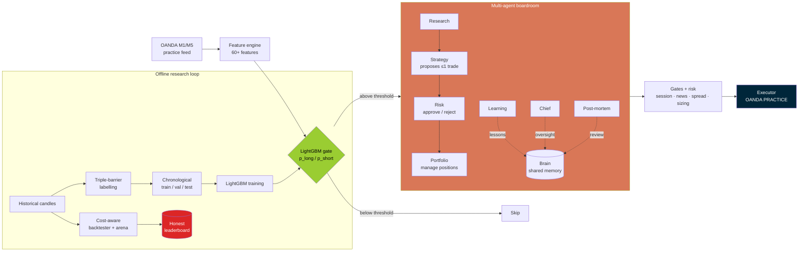

<div align="center">

# 🧪 ML Trading Lab

### An educational research framework combining ML signal classification, a multi-agent Claude "boardroom", and realistic backtesting for forex.

Most "trading bot" repos sell you a magic edge. **ML Trading Lab** does the opposite: it pairs a **leak-aware LightGBM signal gate** with a **multi-agent Claude decision layer** and an **honest, cost-aware backtester** — and then openly reports that the included strategies **have no proven edge**. The interesting part isn't the P&L; it's the *engineering and the intellectual honesty*.


</div>

---

> ## ⚠️ Educational / research only
> **Not financial advice.** **No proven edge** — the included strategies are **NOT profitable** (see the honest evaluation below). The project **defaults to OANDA practice (demo) mode**. Trading involves **substantial risk of loss**. Provided **"as is", with no warranty**. Do not point this at a live real-money account.

---

## 🧠 What's interesting here

This repo is worth reading for two pieces of engineering, not for returns:

### 1. A leak-aware ML validation pipeline
Time-series ML is *very* easy to fool yourself with. This pipeline is built to avoid the classic mistakes:

- **Chronological train / validation / test split** — never random. Train ends `2025-11-30`, validation ends `2026-02-28`, and the **test set is strictly later in time**, so the model is always evaluated on its future.
- **Forward triple-barrier labels** — each M1 bar is labelled by simulating a forward window (120 bars) with a take-profit and stop barrier. When both could be hit in the same bar, the label is resolved to the **stop (conservative)**, so the target never optimistically over-counts wins.
- **Train/serve feature consistency** — the *exact same* `add_ml_features()` function (60+ price-action, MA, volatility, momentum, structure, session and VWAP features) builds the training parquet and scores live M1 windows, so there is no train/serve skew.
- **Spread charged at label time** — entry uses a half-spread offset, so the labels already reflect a realistic cost assumption rather than frictionless fills.

### 2. A multi-agent Claude "boardroom"
Instead of one prompt, decisions flow through a small **org chart of specialised Claude agents** that read from and write to a shared, on-disk **Brain** (knowledge, lessons, post-mortems):

- **Research** → market context, **Strategy** → proposes ≤1 trade, **Risk** → approves/rejects, **Portfolio** → manages open positions, **Learning** → distils lessons.
- A **Chief** agent and a **Post-Mortem** analyst provide meta-oversight and after-the-fact review.
- The **LightGBM gate sits in front of the boardroom**: the Strategy agent is only consulted when the model's probability clears a threshold — ML as a cheap filter, LLMs as the expensive reasoner.

---

## 🧩 Architecture



Data is ingested as M1 candles (M5 context resampled), turned into features, and filtered by the LightGBM gate. Surviving candidates are reasoned over by the Claude boardroom, then passed through deterministic safety **gates** (session windows, news blackout, spread caps) and **risk sizing** before any (practice) execution. Separately, an **offline loop** labels history, trains the models with a leak-aware split, and scores rule strategies in a **cost-aware backtester / arena** whose results feed the honest leaderboard.

---

## 📊 Honest results

Integrity is the whole point of this project, so the numbers are reported straight:

**ML signal gate (held-out test set, strictly out-of-time):**

| Model | Test AUC | Test accuracy |
|-------|---------:|--------------:|
| Long  | **0.663** | 0.80 |
| Short | **0.649** | 0.80 |

Trained on ~1.33M bars, validated on ~0.54M, tested on ~0.34M across six majors (EUR/USD, GBP/USD, USD/JPY, USD/CAD, AUD/USD, NZD/USD). An AUC around **0.66** is a **real but modest** signal — meaningfully better than a coin flip, nowhere near a money printer.

**Rule strategies (out-of-sample arena):** **no edge.** When ~50 candidate rule strategies are evaluated out-of-sample with realistic spread/slippage, **every single one has a profit factor below 1.0** — i.e. they lose money. See [`docs/ARENA_LEADERBOARD.md`](docs/ARENA_LEADERBOARD.md) for the full IS-vs-OOS table.

> **The takeaway:** a modest ML signal does **not** translate into a profitable strategy once execution costs and out-of-sample reality are accounted for. Reporting that honestly is the contribution here — not a backtest curve.

---

## 🛠️ Tech stack

| Area | Tools |
|------|-------|
| **Language** | Python 3.12 |
| **ML** | LightGBM · scikit-learn · numba (JIT labelling) · Optuna (sweeps) |
| **Data** | pandas · NumPy · pyarrow (parquet feature store) |
| **AI agents** | Anthropic Claude (multi-agent boardroom) via `httpx` |
| **Broker** | OANDA REST + streaming (practice/demo) via `requests` |
| **Config / infra** | PyYAML · python-dotenv · Docker |
| **Testing** | pytest · pytest-cov (30 test modules) |

---

## 📦 Getting started

> Defaults to **OANDA practice (demo)** mode. Keep it that way.

```bash
# 1 — clone & install
git clone https://github.com/Mohammed-AB/ml-trading-lab.git
cd ml-trading-lab
python -m venv .venv && source .venv/bin/activate
pip install -r requirements.txt

# 2 — configure environment (practice creds + optional Claude key)
cp .env.example .env        # then edit .env with your PRACTICE values

# 3 — run the test suite
pytest

# 4 — backtest on your own M1 CSV (open,high,low,close,volume[,timestamp])
python main.py backtest --pair EUR_USD --data path/to/candles.csv

# 5 — paper trading against the OANDA PRACTICE endpoint
python main.py paper
```

**Training the ML gate** (optional — needs historical parquet under `data/ml/`):

```bash
python ml_features.py     # build leak-aware features + triple-barrier labels
python ml_train.py        # train long/short LightGBM models, write train_report.json
```

`config/settings.yaml` controls instruments, gates, risk limits, the ML probability threshold, and which Claude agents are enabled. It ships pointing at the **practice** endpoint.

---

## 🗂️ Project structure

```
ml-trading-lab/
├── main.py                     # CLI: backtest · paper · walkforward · analyze
├── config/settings.yaml        # instruments, gates, risk, ML + agent config (practice)
├── src/scalp_mode/
│   ├── ml/                     # bar_features.py + ml_gate.py (leak-aware ML gate)
│   ├── agents/                 # Claude boardroom: research/strategy/risk/portfolio/
│   │                           #   learning + chief/postmortem + shared Brain
│   ├── engine/                 # rule models A–H, regime + feature engines, pipeline
│   ├── backtest/               # cost-aware backtester, walk-forward, go/no-go, metrics
│   ├── execution/              # order builder, executor, risk + trade managers, sizing
│   ├── gates/                  # session, news, spread, data-quality safety gates
│   ├── ai/                     # AI pilot, regime classifier, post-trade analyst
│   ├── data/                   # OANDA price feeder (practice)
│   ├── risk/  utils/           # dynamic sizing, pip + datetime helpers
├── strategy_arena/             # IS-vs-OOS strategy arena + ML sweeps
├── ml_*.py                     # standalone feature / label / training / backtest tools
├── tools/  scripts/            # diagnostics, historical fetch, retrain helpers
├── tests/                      # 30 pytest modules
└── docs/                       # ARENA_LEADERBOARD.md, ML_PIPELINE_V2.md
```

---

## 📄 License

[MIT](LICENSE) © 2026 Mohammed Abumtary

---

<div align="center">

> ## ⚠️ Disclaimer
> **Educational / research only. Not financial advice.** The included strategies have **no proven edge** and are **NOT profitable** out-of-sample. The project **defaults to OANDA practice mode**. Trading involves **substantial risk of loss**. **No warranty** of any kind.

Built by [**@Mohammed-AB**](https://github.com/Mohammed-AB) · [mohammed-ab.github.io](https://mohammed-ab.github.io)

</div>
